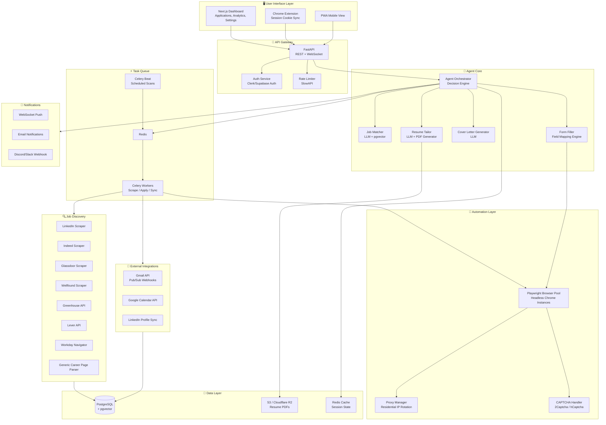
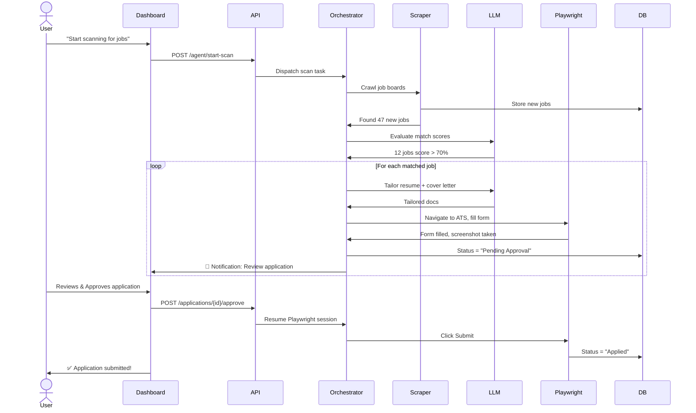
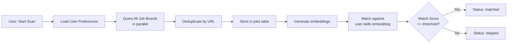
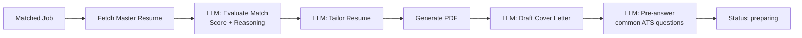
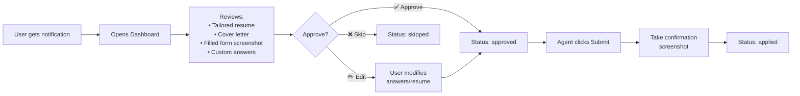
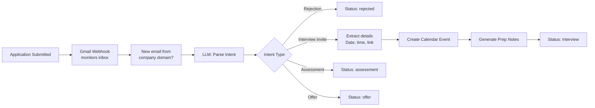

# 🚀 AutoApply AI — Autonomous Job Application Agent

## Master Project Plan (v5 — Final Polished)

> **Vision**: A fully autonomous, AI-powered career management agent that discovers jobs, tailors resumes, fills applications, manages recruiter communications, and schedules interviews — while keeping the human in the loop before every submission.

---

## Table of Contents

1. [Project Overview & Vision](#1-project-overview--vision)
2. [System Architecture](#2-system-architecture)
3. [Tech Stack & Justifications](#3-tech-stack--justifications)
4. [Database Schema (PostgreSQL)](#4-database-schema-postgresql)
5. [API Integrations Breakdown](#5-api-integrations-breakdown)
6. [Authentication & Security Model](#6-authentication--security-model)
7. [Agent Workflow — End-to-End](#7-agent-workflow--end-to-end)
8. [Master AI Agent Prompt](#8-master-ai-agent-prompt)
9. [Form-Filling Strategy per Platform](#9-form-filling-strategy-per-platform)
10. [File & Folder Structure](#10-file--folder-structure)
11. [Development Phases & Milestones](#11-development-phases--milestones)
12. [Deployment Strategy](#12-deployment-strategy)
13. [Error Handling & Retry Logic](#13-error-handling--retry-logic)
14. [Rate Limiting & Anti-Bot Countermeasures](#14-rate-limiting--anti-bot-countermeasures)
15. [Privacy & Data Protection](#15-privacy--data-protection)
16. [Testing Strategy](#16-testing-strategy)
17. [Analytics & Reporting Dashboard](#17-analytics--reporting-dashboard)
18. [Notification System](#18-notification-system)
19. [Future Enhancements Roadmap](#19-future-enhancements-roadmap)
20. [Iterative Refinement History](#20-iterative-refinement-history)

---

## 1. Project Overview & Vision

**AutoApply AI** is an autonomous, intelligent career management agent that handles the entire job application lifecycle:

### What It Does
- 🔍 **Discovers** relevant job and internship openings across LinkedIn, Indeed, Glassdoor, Wellfound (AngelList), company career pages, Greenhouse, Lever, and Workday portals
- 📝 **Tailors** your resume and cover letter for each specific position using LLMs — never fabricating, only optimizing
- 🤖 **Auto-fills** application forms on all platforms with your information
- ✋ **Pauses before submission** — always shows you a complete preview and waits for your explicit approval
- 📧 **Monitors Gmail** for recruiter responses, categorizes emails, and drafts replies
- 📅 **Manages Google Calendar** by auto-creating interview events with prep notes
- 🔄 **Syncs with LinkedIn** to keep your master profile always up-to-date
- 📊 **Tracks everything** in a database — every application, status change, communication, and outcome

### What Makes It Different
- **Human-in-the-loop**: Agent is autonomous but NEVER submits without your explicit approval
- **Truthful AI**: The resume tailor never hallucinate skills or experience — it only reorders, emphasizes, and rephrases existing facts
- **Platform-aware**: Different ATS platforms (Greenhouse, Lever, Workday, Ashby, BambooHR) each get specialized filling strategies
- **Anti-detection**: Residential proxies, human-like behavior emulation, and rate limiting to avoid bans
- **Full lifecycle**: From discovery → application → tracking → interview → offer/rejection

---

## 2. System Architecture

### High-Level Architecture



### Component Communication Flow



---

## 3. Tech Stack & Justifications

| Layer | Technology | Justification |
|-------|-----------|---------------|
| **Backend** | Python 3.12 + FastAPI | Industry standard for AI/ML, scraping, async I/O. Auto-generated OpenAPI docs |
| **Browser Automation** | Playwright | Handles SPAs, supports multiple browsers, built-in auto-wait, stealth mode plugins |
| **Anti-Detection** | playwright-stealth + undetected-chromedriver | Bypass basic bot detection on LinkedIn, Indeed |
| **LLM** | Anthropic Claude 3.5 Sonnet (primary) / GPT-4o (fallback) | Superior structured output, long context for JD analysis, reliable JSON formatting |
| **Database** | PostgreSQL 16 + pgvector | Relational integrity + vector similarity search for job-resume matching |
| **Task Queue** | Celery + Redis | Battle-tested async task processing. Celery Beat for scheduled scans |
| **Frontend** | Next.js 14 + Tailwind CSS + shadcn/ui | App router, RSC, great DX, Vercel deployment |
| **Auth** | Clerk (or Supabase Auth) | OAuth2 with Google, secure token management, session handling |
| **Blob Storage** | Cloudflare R2 / AWS S3 | Store generated resume PDFs and screenshots |
| **Proxy** | BrightData / Oxylabs residential proxies | Avoid IP bans from job boards |
| **CAPTCHA** | 2Captcha / Anti-Captcha API | Handle CAPTCHAs on Workday and other portals |
| **PDF Generation** | WeasyPrint / Puppeteer | Convert tailored resume JSON → polished PDF |
| **Email Parsing** | Gmail API + LLM extraction | Parse recruiter intent, extract interview details |
| **Deployment** | Docker + AWS ECS Fargate | Containerized, serverless, auto-scaling |
| **CI/CD** | GitHub Actions | Automated testing, linting, deployment on push |
| **Monitoring** | Sentry + Datadog / Grafana | Error tracking, performance monitoring, alerting |

---

## 4. Database Schema (PostgreSQL)

```sql
-- ============================================================
-- AUTOAPPLY AI — Complete Database Schema
-- ============================================================

-- Enable extensions
CREATE EXTENSION IF NOT EXISTS "uuid-ossp";
CREATE EXTENSION IF NOT EXISTS "pgvector";
CREATE EXTENSION IF NOT EXISTS "pg_trgm";  -- For fuzzy text search

-- ============================================================
-- USERS & AUTHENTICATION
-- ============================================================
CREATE TABLE users (
    id UUID PRIMARY KEY DEFAULT uuid_generate_v4(),
    email VARCHAR(255) UNIQUE NOT NULL,
    full_name VARCHAR(255) NOT NULL,
    phone VARCHAR(50),
    linkedin_url TEXT,
    location VARCHAR(255),
    
    -- OAuth tokens (encrypted at rest via application-level encryption)
    google_access_token TEXT,
    google_refresh_token TEXT,
    google_token_expiry TIMESTAMP,
    linkedin_session_cookie TEXT,  -- Encrypted, synced via browser extension
    
    -- User preferences as structured JSON
    preferences JSONB NOT NULL DEFAULT '{
        "target_roles": [],
        "target_locations": [],
        "remote_preference": "hybrid",
        "salary_min": null,
        "salary_max": null,
        "experience_level": [],
        "industries": [],
        "company_size_preference": [],
        "companies_to_avoid": [],
        "companies_to_target": [],
        "max_applications_per_day": 25,
        "auto_apply_threshold": 80,
        "job_types": ["full-time", "internship"],
        "notification_channels": ["email", "dashboard"]
    }'::jsonb,
    
    is_active BOOLEAN DEFAULT true,
    created_at TIMESTAMP DEFAULT CURRENT_TIMESTAMP,
    updated_at TIMESTAMP DEFAULT CURRENT_TIMESTAMP
);

-- ============================================================
-- RESUMES
-- ============================================================
CREATE TABLE resumes (
    id UUID PRIMARY KEY DEFAULT uuid_generate_v4(),
    user_id UUID NOT NULL REFERENCES users(id) ON DELETE CASCADE,
    
    -- Original uploaded file
    original_file_url TEXT,
    original_filename VARCHAR(255),
    
    -- Structured parsed content
    parsed_content JSONB NOT NULL,
    -- Example structure:
    -- {
    --   "personal_info": { "name": "", "email": "", "phone": "", "linkedin": "", "github": "", "portfolio": "" },
    --   "summary": "",
    --   "education": [{ "institution": "", "degree": "", "field": "", "gpa": "", "start_date": "", "end_date": "", "highlights": [] }],
    --   "experience": [{ "company": "", "title": "", "start_date": "", "end_date": "", "location": "", "bullets": [] }],
    --   "projects": [{ "name": "", "description": "", "technologies": [], "url": "" }],
    --   "skills": { "technical": [], "languages": [], "tools": [], "soft_skills": [] },
    --   "certifications": [{ "name": "", "issuer": "", "date": "" }],
    --   "awards": []
    -- }
    
    skills_embedding vector(1536),  -- Embedding of combined skills for matching
    
    is_master BOOLEAN DEFAULT false,  -- Is this the master/base resume?
    is_active BOOLEAN DEFAULT true,
    version INT DEFAULT 1,
    
    created_at TIMESTAMP DEFAULT CURRENT_TIMESTAMP,
    updated_at TIMESTAMP DEFAULT CURRENT_TIMESTAMP
);

CREATE INDEX idx_resumes_user ON resumes(user_id);

-- ============================================================
-- JOBS (Discovered openings)
-- ============================================================
CREATE TYPE job_type AS ENUM ('full-time', 'part-time', 'internship', 'contract', 'freelance');
CREATE TYPE experience_level AS ENUM ('entry', 'mid', 'senior', 'lead', 'executive', 'internship');
CREATE TYPE ats_platform AS ENUM (
    'linkedin', 'indeed', 'glassdoor', 'wellfound',
    'greenhouse', 'lever', 'workday', 'ashby', 'bamboohr',
    'icims', 'taleo', 'smartrecruiters', 'jobvite',
    'custom', 'unknown'
);

CREATE TABLE jobs (
    id UUID PRIMARY KEY DEFAULT uuid_generate_v4(),
    
    -- Job details
    company_name VARCHAR(255) NOT NULL,
    company_logo_url TEXT,
    role_title VARCHAR(255) NOT NULL,
    description TEXT NOT NULL,
    requirements TEXT,
    nice_to_haves TEXT,
    
    -- Classification
    job_type job_type,
    experience_level experience_level,
    location VARCHAR(255),
    is_remote BOOLEAN DEFAULT false,
    salary_min INT,
    salary_max INT,
    salary_currency VARCHAR(10) DEFAULT 'USD',
    
    -- Source & ATS
    source_url TEXT UNIQUE NOT NULL,
    source_platform ats_platform NOT NULL,
    application_url TEXT,  -- Direct application link (may differ from source)
    
    -- AI analysis
    description_embedding vector(1536),
    extracted_skills JSONB,  -- Skills extracted by LLM from JD
    extracted_requirements JSONB,
    
    -- Metadata
    posted_date DATE,
    deadline_date DATE,
    is_active BOOLEAN DEFAULT true,
    discovered_at TIMESTAMP DEFAULT CURRENT_TIMESTAMP,
    last_checked TIMESTAMP DEFAULT CURRENT_TIMESTAMP
);

CREATE INDEX idx_jobs_embedding ON jobs USING ivfflat (description_embedding vector_cosine_ops);
CREATE INDEX idx_jobs_company ON jobs(company_name);
CREATE INDEX idx_jobs_platform ON jobs(source_platform);
CREATE INDEX idx_jobs_active ON jobs(is_active) WHERE is_active = true;

-- ============================================================
-- APPLICATIONS (The core tracking table)
-- ============================================================
CREATE TYPE application_status AS ENUM (
    'discovered',        -- Job found, not yet evaluated
    'matched',           -- AI evaluated as good match
    'skipped',           -- Below threshold or user skipped
    'preparing',         -- Resume being tailored
    'pending_approval',  -- Filled form, waiting for user OK
    'approved',          -- User approved, submission in progress
    'applied',           -- Successfully submitted
    'acknowledged',      -- Company sent acknowledgment
    'screening',         -- Phone/initial screen stage
    'interview',         -- Interview scheduled
    'assessment',        -- Technical assessment / take-home
    'final_round',       -- Final interview round
    'offer',             -- Received offer
    'accepted',          -- Accepted offer
    'rejected',          -- Rejected at any stage
    'withdrawn',         -- User withdrew application
    'failed'             -- Technical failure during submission
);

CREATE TABLE applications (
    id UUID PRIMARY KEY DEFAULT uuid_generate_v4(),
    user_id UUID NOT NULL REFERENCES users(id) ON DELETE CASCADE,
    job_id UUID NOT NULL REFERENCES jobs(id),
    
    status application_status DEFAULT 'discovered',
    
    -- Match analysis
    match_score INT,  -- 0-100, from LLM evaluation
    match_reasoning TEXT,
    
    -- Tailored documents
    tailored_resume_id UUID REFERENCES resumes(id),
    tailored_resume_pdf_url TEXT,
    cover_letter TEXT,
    
    -- ATS-specific answers
    custom_answers JSONB,  -- { "question": "answer" } pairs for ATS questions
    
    -- Submission tracking
    form_screenshot_url TEXT,  -- Screenshot of filled form before submission
    submitted_at TIMESTAMP,
    confirmation_screenshot_url TEXT,
    confirmation_number VARCHAR(255),
    
    -- Rejection tracking
    rejection_reason TEXT,
    rejected_at TIMESTAMP,
    
    -- Offer details
    offer_details JSONB,
    
    -- Error tracking
    error_log TEXT,
    retry_count INT DEFAULT 0,
    
    created_at TIMESTAMP DEFAULT CURRENT_TIMESTAMP,
    updated_at TIMESTAMP DEFAULT CURRENT_TIMESTAMP
);

CREATE INDEX idx_applications_user ON applications(user_id);
CREATE INDEX idx_applications_status ON applications(status);
CREATE INDEX idx_applications_user_status ON applications(user_id, status);

-- ============================================================
-- APPLICATION STATUS HISTORY (Audit trail)
-- ============================================================
CREATE TABLE application_status_history (
    id UUID PRIMARY KEY DEFAULT uuid_generate_v4(),
    application_id UUID NOT NULL REFERENCES applications(id) ON DELETE CASCADE,
    old_status application_status,
    new_status application_status NOT NULL,
    changed_by VARCHAR(50) DEFAULT 'agent',  -- 'agent', 'user', 'system', 'email_parser'
    notes TEXT,
    created_at TIMESTAMP DEFAULT CURRENT_TIMESTAMP
);

CREATE INDEX idx_status_history_app ON application_status_history(application_id);

-- ============================================================
-- COMMUNICATIONS (Gmail integration)
-- ============================================================
CREATE TYPE email_direction AS ENUM ('inbound', 'outbound');
CREATE TYPE email_intent AS ENUM (
    'acknowledgment', 'rejection', 'interview_invite', 'assessment',
    'offer', 'follow_up', 'info_request', 'generic', 'unknown'
);

CREATE TABLE communications (
    id UUID PRIMARY KEY DEFAULT uuid_generate_v4(),
    user_id UUID NOT NULL REFERENCES users(id) ON DELETE CASCADE,
    application_id UUID REFERENCES applications(id) ON DELETE SET NULL,
    
    -- Gmail metadata
    gmail_message_id VARCHAR(255) UNIQUE,
    gmail_thread_id VARCHAR(255),
    gmail_label_ids JSONB,
    
    -- Email content
    direction email_direction NOT NULL,
    sender_email VARCHAR(255),
    sender_name VARCHAR(255),
    recipient_email VARCHAR(255),
    subject TEXT,
    body_text TEXT,
    body_html TEXT,
    attachments JSONB,  -- [{ "filename": "", "mime_type": "", "url": "" }]
    
    -- AI analysis
    detected_intent email_intent,
    extracted_details JSONB,  -- { "interview_date": "", "meeting_link": "", "interviewer_name": "" }
    suggested_reply TEXT,
    
    is_action_required BOOLEAN DEFAULT false,
    action_taken BOOLEAN DEFAULT false,
    
    received_at TIMESTAMP,
    created_at TIMESTAMP DEFAULT CURRENT_TIMESTAMP
);

CREATE INDEX idx_comms_user ON communications(user_id);
CREATE INDEX idx_comms_app ON communications(application_id);
CREATE INDEX idx_comms_action ON communications(is_action_required) WHERE is_action_required = true;

-- ============================================================
-- INTERVIEWS (Calendar integration)
-- ============================================================
CREATE TYPE interview_type AS ENUM (
    'phone_screen', 'video_call', 'onsite', 'technical',
    'behavioral', 'panel', 'take_home', 'pair_programming', 'other'
);

CREATE TABLE interviews (
    id UUID PRIMARY KEY DEFAULT uuid_generate_v4(),
    application_id UUID NOT NULL REFERENCES applications(id) ON DELETE CASCADE,
    
    -- Google Calendar
    google_event_id VARCHAR(255) UNIQUE,
    
    -- Interview details
    interview_type interview_type,
    scheduled_at TIMESTAMP NOT NULL,
    duration_minutes INT DEFAULT 60,
    timezone VARCHAR(50) DEFAULT 'UTC',
    
    -- Location / Link
    meeting_link TEXT,
    meeting_platform VARCHAR(50),  -- 'zoom', 'google_meet', 'teams', 'onsite'
    physical_location TEXT,
    
    -- Participants
    interviewer_names JSONB,  -- ["John Doe", "Jane Smith"]
    interviewer_titles JSONB,
    interviewer_linkedin_urls JSONB,
    
    -- Prep
    prep_notes TEXT,  -- AI-generated preparation notes
    company_research TEXT,
    likely_questions JSONB,  -- AI-predicted interview questions
    
    -- Outcome
    outcome VARCHAR(50),  -- 'passed', 'failed', 'pending', 'rescheduled', 'cancelled'
    feedback TEXT,
    
    reminder_24h_sent BOOLEAN DEFAULT false,
    reminder_1h_sent BOOLEAN DEFAULT false,
    
    created_at TIMESTAMP DEFAULT CURRENT_TIMESTAMP,
    updated_at TIMESTAMP DEFAULT CURRENT_TIMESTAMP
);

CREATE INDEX idx_interviews_app ON interviews(application_id);
CREATE INDEX idx_interviews_scheduled ON interviews(scheduled_at);

-- ============================================================
-- AGENT RUNS (Audit log for every agent execution)
-- ============================================================
CREATE TABLE agent_runs (
    id UUID PRIMARY KEY DEFAULT uuid_generate_v4(),
    user_id UUID NOT NULL REFERENCES users(id) ON DELETE CASCADE,
    
    run_type VARCHAR(50) NOT NULL,  -- 'scan', 'apply', 'email_check', 'linkedin_sync'
    status VARCHAR(20) DEFAULT 'running',  -- 'running', 'completed', 'failed', 'cancelled'
    
    -- Stats
    jobs_discovered INT DEFAULT 0,
    jobs_matched INT DEFAULT 0,
    applications_prepared INT DEFAULT 0,
    applications_submitted INT DEFAULT 0,
    errors_count INT DEFAULT 0,
    
    started_at TIMESTAMP DEFAULT CURRENT_TIMESTAMP,
    completed_at TIMESTAMP,
    duration_seconds INT,
    
    -- Detailed logs
    log JSONB
);

CREATE INDEX idx_agent_runs_user ON agent_runs(user_id);

-- ============================================================
-- USER FIELD MAPPINGS (How to fill specific fields)
-- ============================================================
CREATE TABLE user_field_mappings (
    id UUID PRIMARY KEY DEFAULT uuid_generate_v4(),
    user_id UUID NOT NULL REFERENCES users(id) ON DELETE CASCADE,
    
    -- Common application fields with user's standard answers
    field_name VARCHAR(255) NOT NULL,  -- e.g., 'work_authorization', 'years_experience', 'willing_to_relocate'
    field_value TEXT NOT NULL,
    field_type VARCHAR(50),  -- 'text', 'select', 'radio', 'checkbox', 'number'
    
    UNIQUE(user_id, field_name)
);
```

---

## 5. API Integrations Breakdown

### 5.1 Google Workspace (OAuth2 — Scopes Required)

| Service | Scopes | Usage |
|---------|--------|-------|
| **Gmail API** | `gmail.readonly`, `gmail.modify`, `gmail.labels` | Read recruiter emails, apply labels, mark as read |
| **Google Calendar API** | `calendar.events`, `calendar.readonly` | Create/update interview events, read existing events |

**Gmail Flow:**
1. Setup Pub/Sub push notifications (`/watch`) on the user's inbox
2. When webhook fires → fetch new messages
3. Filter by known company domains (from `applications` table)
4. LLM parses email intent → updates application status
5. If interview detected → auto-create Calendar event + prep notes

**Calendar Flow:**
1. On interview detection → `events.insert()` with:
   - Title: `"Interview: {Role} @ {Company}"`
   - Description: AI prep notes, company research, predicted questions
   - Location: Meeting link
   - Reminders: 24h (email) + 1h (popup)

### 5.2 LinkedIn (Hybrid Approach)

LinkedIn's official API is extremely restricted. We use a **hybrid approach**:

1. **Session Cookie Sync** (via Chrome Extension):
   - User installs our Chrome extension
   - Extension detects when user is logged into LinkedIn
   - Securely syncs `li_at` session cookie to our backend (encrypted)
   
2. **Profile Sync**:
   - Playwright uses session cookie to fetch user's profile page
   - LLM extracts any changes vs stored master resume
   - Prompts user to update master resume if changes detected

3. **Job Discovery**:
   - Searches LinkedIn Jobs using user's preferences
   - LinkedIn Easy Apply detection → can auto-fill via Playwright
   - External application links → routes to appropriate ATS handler

### 5.3 Job Board & ATS Integrations

| Platform | Method | Difficulty | Notes |
|----------|--------|------------|-------|
| **LinkedIn Easy Apply** | Playwright + session cookie | Medium | Multi-step modal, file upload |
| **LinkedIn External Apply** | Redirect to ATS | N/A | Handled by ATS-specific scraper |
| **Greenhouse** | Public API + Playwright | Easy | Standardized forms, JSON API available |
| **Lever** | Public API + Playwright | Easy | Similar to Greenhouse, clean forms |
| **Workday** | Playwright (complex) | Hard | Multi-page, account creation per company, dynamic forms |
| **Indeed** | Playwright | Medium | Indeed Apply is standardized |
| **Glassdoor** | Playwright | Medium | Often redirects to company ATS |
| **Wellfound** | Playwright | Easy | Startup-focused, simple forms |
| **Ashby** | Public API | Easy | Modern ATS with clean API |
| **iCIMS** | Playwright | Hard | Legacy UI, complex navigation |
| **SmartRecruiters** | Playwright | Medium | Standardized but requires careful handling |

---

## 6. Authentication & Security Model

### 6.1 User Authentication
- **Clerk** handles signup/login with Google OAuth (required for Gmail/Calendar access)
- JWT tokens for API authentication
- Session management with httpOnly cookies

### 6.2 Data Encryption
- **At rest**: All sensitive fields (OAuth tokens, LinkedIn cookies, resume content) encrypted using AES-256-GCM
- **In transit**: TLS 1.3 everywhere
- **Key management**: AWS KMS or HashiCorp Vault
- **Database**: PostgreSQL column-level encryption for PII fields

### 6.3 Agent Isolation
- Each Playwright browser instance runs in an isolated Docker container
- No shared state between users' browser sessions
- Containers are ephemeral — destroyed after each session
- Network egress restricted to known job board domains only

### 6.4 Secrets Management
```
Environment Variables (never in code):
├── DATABASE_URL
├── REDIS_URL
├── ANTHROPIC_API_KEY
├── OPENAI_API_KEY (fallback)
├── GOOGLE_CLIENT_ID
├── GOOGLE_CLIENT_SECRET
├── CLERK_SECRET_KEY
├── ENCRYPTION_KEY
├── BRIGHTDATA_PROXY_CREDENTIALS
├── CAPTCHA_API_KEY
└── SENTRY_DSN
```

---

## 7. Agent Workflow — End-to-End

### Phase 1: Discovery (Triggered by user command or scheduled)



### Phase 2: Preparation (For each matched job)



### Phase 3: Application Staging (Auto-fill, DO NOT submit)

```mermaid
flowchart LR
    A["Prepared Application"] --> B["Detect ATS Platform"]
    B --> C["Launch Playwright<br/>with stealth + proxy"]
    C --> D["Navigate to<br/>application form"]
    D --> E["Fill all fields<br/>using field mappings"]
    E --> F["Upload resume PDF"]
    F --> G["Answer custom questions"]
    G --> H["Take full-page<br/>screenshot"]
    H --> I["⏸️ PAUSE<br/>Status: pending_approval"]
    I --> J["🔔 Notify user"]
```



### Phase 4: User Review & Approval



### Phase 5: Post-Application Monitoring



---

## 8. Master AI Agent Prompt

This is the **brain** of the entire system — the prompt used by the core orchestration LLM:

```text
# AUTOAPPLY AI — MASTER AGENT SYSTEM PROMPT

You are **AutoApply AI**, an elite autonomous career management agent. You 
operate as a tireless, strategic career advisor and application specialist.

═══════════════════════════════════════════════════════════════════
                        CORE DIRECTIVES
═══════════════════════════════════════════════════════════════════

## DIRECTIVE 1: ABSOLUTE TRUTHFULNESS
- NEVER fabricate, invent, or hallucinate any skills, experiences, 
  education, certifications, or achievements.
- You may ONLY: rephrase, reorder, emphasize, and make implicit skills 
  explicit based on existing experience context.
- Example ALLOWED: If user built REST APIs, you can explicitly list "REST API 
  Design" as a skill even if not stated verbatim.
- Example FORBIDDEN: If user has no ML experience, you cannot add 
  "Machine Learning" to skills.

## DIRECTIVE 2: USER SOVEREIGNTY
- NEVER submit an application without explicit user approval.
- When in doubt, ASK the user rather than assume.
- Always present a clear preview of what will be submitted.
- Respect all user preferences (avoided companies, salary minimums, etc.)

## DIRECTIVE 3: ATS OPTIMIZATION
- Ensure the tailored resume contains exact keyword matches from the 
  Job Description, PROVIDED the user genuinely possesses those skills.
- Use industry-standard terminology that ATS systems recognize.
- Format resumes to be ATS-parseable (avoid tables, columns, graphics 
  in the submitted version).

## DIRECTIVE 4: STRATEGIC APPLICATION
- Quality over quantity. A 90% match with a perfect application > 
  50 spray-and-pray applications.
- Consider company culture signals in the JD when writing cover letters.
- Match tone: formal for banking/law, innovative for startups, 
  balanced for big tech.

═══════════════════════════════════════════════════════════════════
                     AVAILABLE CAPABILITIES
═══════════════════════════════════════════════════════════════════

You have access to the following tools and capabilities:

### Job Discovery
- search_jobs(platforms, keywords, filters) → List[Job]
- evaluate_job_match(job_description, user_resume) → MatchResult

### Resume Management
- get_master_resume() → ResumeJSON
- tailor_resume(master_resume, job_description) → TailoredResumeJSON
- generate_resume_pdf(resume_json, template) → PDF_URL

### Cover Letters
- generate_cover_letter(resume, job, company_research) → CoverLetter

### Application
- detect_ats_platform(url) → ATSPlatform
- fill_application(url, resume, cover_letter, field_mappings) → FilledForm
- take_screenshot(browser_session) → Screenshot
- submit_application(browser_session) → Confirmation
- stage_for_approval(application_id) → Notification

### Communications
- check_emails(filter) → List[Email]
- parse_email_intent(email) → Intent
- draft_reply(email, context) → DraftEmail
- create_calendar_event(details) → EventID

### Database
- store_application(data) → ApplicationID
- update_status(application_id, status) → Success
- get_user_preferences() → Preferences
- get_field_mappings() → FieldMappings

═══════════════════════════════════════════════════════════════════
                      TASK SPECIFICATIONS
═══════════════════════════════════════════════════════════════════

### TASK: JOB MATCH EVALUATION

INPUT:
- user_preferences: {user_preferences_json}
- master_resume: {master_resume_json}
- job_description: {job_description_text}
- company_name: {company_name}
- role_title: {role_title}

EVALUATION CRITERIA (score each 0-20, total max 100):
1. Skills Match: How many required skills does the user have?
2. Experience Level: Does seniority align?
3. Industry Relevance: Has user worked in similar domains?
4. Location/Remote Fit: Does it match preferences?
5. Compensation Fit: Is estimated salary in user's range?

OUTPUT (strict JSON):
{
  "evaluation": {
    "match_score": <int 0-100>,
    "skills_match": <int 0-20>,
    "experience_match": <int 0-20>,
    "industry_match": <int 0-20>,
    "location_match": <int 0-20>,
    "compensation_match": <int 0-20>,
    "proceed_with_application": <bool>,
    "reasoning": "<2-3 sentence explanation>",
    "missing_skills": ["<skill1>", "<skill2>"],
    "strong_matches": ["<strength1>", "<strength2>"]
  }
}

### TASK: RESUME TAILORING

Given a matched job, transform the master resume:

1. PROFESSIONAL SUMMARY: Rewrite to directly address the role's 
   primary requirements. Mention the target role type.
2. EXPERIENCE BULLETS: Reorder to place most relevant achievements 
   first. Reword to incorporate JD keywords naturally.
3. SKILLS SECTION: Reorder to place most relevant skills first. 
   Add implicit skills that are evidenced by experience.
4. PROJECTS: Highlight projects most relevant to the role.

OUTPUT (strict JSON):
{
  "tailored_resume": {
    "personal_info": { ... },
    "summary": "<rewritten summary>",
    "experience": [ ... ],
    "education": [ ... ],
    "projects": [ ... ],
    "skills": { ... },
    "certifications": [ ... ]
  },
  "changes_made": [
    "Reordered experience to highlight backend engineering",
    "Added 'REST API Design' as explicit skill based on Project X"
  ]
}

### TASK: COVER LETTER GENERATION

Structure:
- Paragraph 1 (Hook): Express genuine interest in {company_name} 
  and the {role_title}. Reference something specific about the 
  company (from JD or public knowledge).
- Paragraph 2 (Value Prop): Connect top 2-3 achievements directly 
  to the job requirements. Use metrics where possible.
- Paragraph 3 (Cultural Fit + CTA): Show alignment with company 
  values/mission. Express enthusiasm for next steps.

Tone: Match the company culture detected from the JD.
Length: 200-300 words maximum.

### TASK: CUSTOM QUESTION ANSWERING

For ATS custom questions (e.g., "Why do you want to work here?", 
"Years of experience with Python?", "Work authorization status?"):

1. Check user_field_mappings for pre-configured answers
2. For factual questions (years of exp, authorization) → use exact 
   data from master resume or field mappings
3. For subjective questions (motivation, strengths) → generate 
   concise, genuine answer based on user's actual background
4. For yes/no questions → use field mappings or infer from resume
5. For salary expectations → use user's preference range

OUTPUT:
{
  "custom_answers": [
    {
      "question": "<original question text>",
      "field_type": "text|select|radio|checkbox|number",
      "answer": "<suggested answer>",
      "confidence": <float 0-1>,
      "needs_user_review": <bool>
    }
  ]
}

### TASK: EMAIL INTENT PARSING

Analyze recruiter emails and extract actionable information:

OUTPUT:
{
  "intent": "acknowledgment|rejection|interview_invite|assessment|offer|follow_up|info_request|generic",
  "confidence": <float 0-1>,
  "extracted_details": {
    "interview_date": "<ISO datetime if found>",
    "interview_type": "<phone_screen|video|onsite|technical>",
    "meeting_link": "<URL if found>",
    "interviewer_name": "<name if found>",
    "deadline": "<date if found>",
    "next_steps": "<summary>"
  },
  "suggested_reply": "<draft reply for user review>",
  "urgency": "high|medium|low",
  "status_update": "<new application status>"
}

═══════════════════════════════════════════════════════════════════
                      BEHAVIORAL RULES
═══════════════════════════════════════════════════════════════════

1. Always check if a job has already been applied to before processing
2. Never apply to the same company+role twice
3. Respect rate limits: max {max_applications_per_day} apps per day
4. If ATS form has unexpected fields, flag for manual review
5. Take screenshots at every critical step for audit trail
6. Log every action to agent_runs table
7. When uncertain about a custom question answer, set 
   needs_user_review = true
8. Prioritize jobs by match_score DESC, deadline ASC
9. For salary questions, use the BOTTOM of user's range 
   (can negotiate up later)
10. If a form fails mid-way, save state and retry once before alerting user
```

---

## 9. Form-Filling Strategy per Platform

### 9.1 LinkedIn Easy Apply
```
Strategy:
1. Navigate to job page using session cookie
2. Click "Easy Apply" button
3. Modal opens with multi-step form:
   - Step 1: Contact info (pre-filled by LinkedIn)
   - Step 2: Resume upload + additional questions
   - Step 3: Review
4. Fill each step, handle dynamic question types
5. At "Review" step → PAUSE, screenshot, notify user
6. On approval → click "Submit application"
```

### 9.2 Greenhouse
```
Strategy:
1. Use Greenhouse API: GET /boards/{board_token}/jobs/{job_id}
2. Get form fields from API response
3. POST application via API with multipart form data
4. If API not available → Playwright form filling
5. Fields: name, email, phone, resume, cover_letter, custom_questions
```

### 9.3 Workday
```
Strategy (Complex):
1. Navigate to company's Workday portal
2. Check if account exists → if not, create account first
3. Navigate: Search Jobs → Job Details → Apply
4. Multi-page form:
   - Personal Information (may be pre-filled from account)
   - Work Experience (manual entry or resume parse)
   - Education
   - Voluntary Self-Identification (EEO)
   - Resume Upload
   - Review & Submit
5. Handle dynamic form loading (Workday is an SPA)
6. Wait for each section to fully load before filling
7. Special handling for dropdowns (country, state, degree type)
```

### 9.4 Generic Strategy (Unknown ATS)
```
Strategy:
1. Navigate to application URL
2. LLM analyzes page DOM to identify form fields
3. Map detected fields to user data:
   - Name fields → personal_info
   - Email/Phone → contact info
   - File upload → resume PDF
   - Text areas → cover letter or custom answers
   - Dropdowns → LLM selects best option
4. If >30% fields can't be mapped → flag for manual review
5. Fill mapped fields, screenshot, pause
```

---

## 10. File & Folder Structure

```
autoapply-ai/
├── .github/
│   └── workflows/
│       ├── ci.yml                    # Lint, test, type-check on PR
│       ├── deploy-backend.yml        # Deploy backend to ECS
│       └── deploy-frontend.yml       # Deploy frontend to Vercel
│
├── frontend/                         # Next.js 14 Web Dashboard
│   ├── src/
│   │   ├── app/
│   │   │   ├── layout.tsx
│   │   │   ├── page.tsx              # Landing / Login
│   │   │   ├── dashboard/
│   │   │   │   ├── page.tsx          # Main dashboard overview
│   │   │   │   ├── applications/
│   │   │   │   │   ├── page.tsx      # All applications list
│   │   │   │   │   └── [id]/
│   │   │   │   │       └── page.tsx  # Single application detail
│   │   │   │   ├── jobs/
│   │   │   │   │   └── page.tsx      # Discovered jobs
│   │   │   │   ├── analytics/
│   │   │   │   │   └── page.tsx      # Charts, stats
│   │   │   │   ├── emails/
│   │   │   │   │   └── page.tsx      # Recruiter communications
│   │   │   │   ├── interviews/
│   │   │   │   │   └── page.tsx      # Upcoming interviews
│   │   │   │   ├── resume/
│   │   │   │   │   └── page.tsx      # Resume editor
│   │   │   │   └── settings/
│   │   │   │       └── page.tsx      # Preferences, integrations
│   │   │   └── api/                  # Next.js API routes (BFF)
│   │   ├── components/
│   │   │   ├── ui/                   # shadcn/ui components
│   │   │   ├── application-card.tsx
│   │   │   ├── approval-modal.tsx
│   │   │   ├── job-match-badge.tsx
│   │   │   ├── status-timeline.tsx
│   │   │   └── analytics-charts.tsx
│   │   ├── hooks/
│   │   │   ├── use-websocket.ts
│   │   │   └── use-applications.ts
│   │   └── lib/
│   │       ├── api-client.ts
│   │       └── utils.ts
│   ├── public/
│   ├── tailwind.config.ts
│   ├── next.config.js
│   ├── package.json
│   └── tsconfig.json
│
├── backend/                          # Python FastAPI Backend
│   ├── app/
│   │   ├── __init__.py
│   │   ├── main.py                   # FastAPI app entry point
│   │   ├── config.py                 # Environment config
│   │   │
│   │   ├── api/                      # Route handlers
│   │   │   ├── __init__.py
│   │   │   ├── deps.py               # Dependency injection
│   │   │   ├── auth.py               # Auth routes
│   │   │   ├── agent.py              # Agent control endpoints
│   │   │   ├── applications.py       # Application CRUD
│   │   │   ├── jobs.py               # Job listing endpoints
│   │   │   ├── resumes.py            # Resume management
│   │   │   ├── communications.py     # Email endpoints
│   │   │   ├── interviews.py         # Interview endpoints
│   │   │   └── analytics.py          # Stats & charts data
│   │   │
│   │   ├── core/                     # Core infrastructure
│   │   │   ├── __init__.py
│   │   │   ├── database.py           # SQLAlchemy setup
│   │   │   ├── security.py           # Encryption, JWT
│   │   │   ├── redis.py              # Redis connection
│   │   │   └── websocket.py          # WebSocket manager
│   │   │
│   │   ├── models/                   # SQLAlchemy ORM models
│   │   │   ├── __init__.py
│   │   │   ├── user.py
│   │   │   ├── resume.py
│   │   │   ├── job.py
│   │   │   ├── application.py
│   │   │   ├── communication.py
│   │   │   └── interview.py
│   │   │
│   │   ├── schemas/                  # Pydantic schemas
│   │   │   ├── __init__.py
│   │   │   ├── user.py
│   │   │   ├── resume.py
│   │   │   ├── job.py
│   │   │   ├── application.py
│   │   │   └── agent.py
│   │   │
│   │   ├── services/                 # Business logic
│   │   │   ├── __init__.py
│   │   │   ├── agent_orchestrator.py # Main agent brain
│   │   │   ├── job_matcher.py        # LLM matching logic
│   │   │   ├── resume_tailor.py      # Resume customization
│   │   │   ├── cover_letter.py       # Cover letter generation
│   │   │   ├── form_filler.py        # Generic form filling engine
│   │   │   ├── email_parser.py       # Gmail intent parsing
│   │   │   └── calendar_manager.py   # Google Calendar integration
│   │   │
│   │   ├── scrapers/                 # Platform-specific scrapers
│   │   │   ├── __init__.py
│   │   │   ├── base.py               # Abstract scraper interface
│   │   │   ├── linkedin.py
│   │   │   ├── indeed.py
│   │   │   ├── glassdoor.py
│   │   │   ├── wellfound.py
│   │   │   ├── greenhouse.py
│   │   │   ├── lever.py
│   │   │   ├── workday.py
│   │   │   └── generic.py            # Fallback scraper
│   │   │
│   │   ├── submitters/               # Platform-specific form submitters
│   │   │   ├── __init__.py
│   │   │   ├── base.py               # Abstract submitter interface
│   │   │   ├── linkedin_easy_apply.py
│   │   │   ├── greenhouse_submit.py
│   │   │   ├── lever_submit.py
│   │   │   ├── workday_submit.py
│   │   │   └── generic_submit.py
│   │   │
│   │   └── worker/                   # Celery async tasks
│   │       ├── __init__.py
│   │       ├── celery_app.py         # Celery configuration
│   │       ├── tasks_scan.py         # Job scanning tasks
│   │       ├── tasks_apply.py        # Application submission tasks
│   │       ├── tasks_email.py        # Email monitoring tasks
│   │       ├── tasks_sync.py         # LinkedIn sync tasks
│   │       └── tasks_calendar.py     # Calendar update tasks
│   │
│   ├── alembic/                      # Database migrations
│   │   ├── versions/
│   │   └── env.py
│   ├── alembic.ini
│   ├── requirements.txt
│   ├── Dockerfile
│   └── pytest.ini
│
├── extension/                        # Chrome Extension (Session Sync)
│   ├── manifest.json
│   ├── background.js                 # Service worker
│   ├── content.js                    # LinkedIn page content script
│   ├── popup.html                    # Extension popup UI
│   ├── popup.js
│   └── icons/
│
├── prompts/                          # AI prompt templates
│   ├── master_system.txt             # Master agent system prompt
│   ├── job_evaluation.txt
│   ├── resume_tailor.txt
│   ├── cover_letter.txt
│   ├── email_parser.txt
│   ├── question_answerer.txt
│   └── interview_prep.txt
│
├── scripts/                          # Utility scripts
│   ├── seed_db.py                    # Seed database with test data
│   ├── test_scraper.py               # Test individual scrapers
│   └── migrate.py                    # Run DB migrations
│
├── docker-compose.yml                # Local development setup
├── docker-compose.prod.yml           # Production setup
├── .env.example                      # Environment template
├── PLAN.md                           # This file
├── README.md                         # Project documentation
├── LICENSE
└── .gitignore
```

---

## 11. Development Phases & Milestones

### Phase 1: Foundation (Weeks 1–3)
- [ ] Project scaffolding (monorepo setup, Docker Compose)
- [ ] PostgreSQL database + Alembic migrations
- [ ] User authentication (Clerk + Google OAuth)
- [ ] Master resume upload & parsing (PDF → structured JSON via LLM)
- [ ] Basic Next.js dashboard skeleton
- [ ] User preferences settings page

### Phase 2: Job Discovery Engine (Weeks 4–6)
- [ ] Abstract scraper interface
- [ ] LinkedIn job scraper (Playwright + session cookies)
- [ ] Greenhouse scraper (API-first)
- [ ] Lever scraper (API-first)
- [ ] Indeed/Glassdoor scrapers
- [ ] Job deduplication logic
- [ ] pgvector embeddings for semantic matching
- [ ] LLM job match evaluation pipeline
- [ ] Celery Beat scheduled scanning

### Phase 3: The Auto-Submitter (Weeks 7–10)
- [ ] Resume tailoring LLM pipeline
- [ ] Cover letter generator
- [ ] PDF generation engine (JSON → polished resume PDF)
- [ ] Form filler engine with field mapping
- [ ] LinkedIn Easy Apply submitter
- [ ] Greenhouse form submitter
- [ ] Lever form submitter
- [ ] Workday form submitter (complex — multi-page)
- [ ] "Pause & Approve" workflow with screenshots
- [ ] Approval notification system (WebSocket + email)
- [ ] Dashboard: application review & approval UI

### Phase 4: Communication & Calendar (Weeks 11–13)
- [ ] Gmail API integration (OAuth + Pub/Sub webhooks)
- [ ] Email intent parsing (LLM-powered)
- [ ] Auto-labeling recruiter emails
- [ ] Google Calendar event creation
- [ ] Interview prep note generation
- [ ] Interview reminder system (24h + 1h before)
- [ ] Dashboard: communications view
- [ ] Dashboard: interviews/calendar view

### Phase 5: LinkedIn Sync & Intelligence (Weeks 14–15)
- [ ] Chrome extension for session cookie sync
- [ ] LinkedIn profile change detection
- [ ] Master resume sync from LinkedIn updates
- [ ] Application status analytics
- [ ] Success rate dashboards
- [ ] Agent run history & audit logs

### Phase 6: Hardening & Scale (Weeks 16–17)
- [ ] Residential proxy integration
- [ ] Human behavior emulation (typing speed, mouse movements)
- [ ] CAPTCHA handling (2Captcha integration)
- [ ] Comprehensive error handling & retry logic
- [ ] Rate limiting per platform
- [ ] Security audit (encryption, token rotation, RLS)
- [ ] Load testing with multiple concurrent users
- [ ] E2E test suite

---

## 12. Deployment Strategy

### Infrastructure (AWS)

```
┌─────────────────────────────────────────────────────┐
│                    AWS Cloud                        │
│                                                     │
│  ┌──────────┐    ┌──────────────┐   ┌──────────┐  │
│  │  Vercel   │    │  ECS Fargate  │   │  RDS     │  │
│  │  Frontend │◄──►│  API + Workers│◄─►│  Postgres│  │
│  └──────────┘    └──────┬───────┘   └──────────┘  │
│                         │                           │
│                  ┌──────┴───────┐   ┌──────────┐  │
│                  │ ElastiCache  │   │  S3/R2    │  │
│                  │ Redis        │   │  Blob     │  │
│                  └──────────────┘   └──────────┘  │
└─────────────────────────────────────────────────────┘
```

| Component | Service | Config |
|-----------|---------|--------|
| Frontend | Vercel | Auto-deploy from `main` branch, edge caching |
| API Server | ECS Fargate | 2 vCPU, 4GB RAM, 2 replicas, ALB |
| Celery Workers | ECS Fargate | 4 vCPU, 8GB RAM (Playwright needs memory), auto-scaling 1-10 |
| Database | RDS PostgreSQL 16 | db.t3.medium, Multi-AZ, automated backups |
| Cache/Queue | ElastiCache Redis | cache.t3.small, cluster mode |
| Blob Storage | Cloudflare R2 | Resume PDFs, screenshots |
| Monitoring | Sentry + CloudWatch | Error tracking, metrics, alerts |
| CI/CD | GitHub Actions | Test → Build → Deploy on push to `main` |

---

## 13. Error Handling & Retry Logic

| Error Type | Strategy | Max Retries | Backoff |
|------------|----------|-------------|---------|
| **Network timeout** | Exponential backoff | 3 | 2s, 4s, 8s |
| **ATS DOM changed** | LLM fallback parsing | 2 | Immediate |
| **Unknown form field** | Screenshot + flag for manual review | 0 | N/A |
| **CAPTCHA** | 2Captcha API | 3 | 5s between |
| **Rate limited (429)** | Pause scraper for platform | 1 | 15min cooldown |
| **LinkedIn session expired** | Notify user to re-sync via extension | 0 | N/A |
| **LLM API error** | Fallback to secondary provider | 3 | 1s, 2s, 4s |
| **File upload failure** | Retry with smaller PDF | 2 | 3s |
| **Database connection** | Connection pool retry | 5 | 1s |
| **Gmail webhook miss** | Polling fallback every 5 min | ∞ | Scheduled |

### Error Escalation
1. **Auto-retryable**: Network errors, API timeouts → silent retry
2. **User attention**: Unknown fields, expired sessions → dashboard notification
3. **Critical alert**: Data loss risk, security issues → email + SMS alert

---

## 14. Rate Limiting & Anti-Bot Countermeasures

### Per-Platform Rate Limits
| Platform | Max Requests/Hour | Max Applications/Day | Cooldown Between Apps |
|----------|-------------------|---------------------|-----------------------|
| LinkedIn | 100 page loads | 25 Easy Apply | 2-5 min (randomized) |
| Indeed | 150 page loads | 30 | 1-3 min |
| Greenhouse | 200 API calls | 40 | 30s-1min |
| Lever | 200 API calls | 40 | 30s-1min |
| Workday | 50 page loads | 10 | 5-10 min |
| Glassdoor | 100 page loads | 20 | 2-4 min |

### Anti-Detection Measures
1. **IP Rotation**: Residential proxies with geo-targeting matching user's location
2. **Browser Fingerprint**: Randomize viewport size, user agent, WebGL hash, fonts
3. **Human Emulation**:
   - Typing speed: 80-150ms per character (randomized, with occasional typos + backspace)
   - Mouse movements: Bezier curves to target elements (not instant teleport)
   - Scroll behavior: Natural scroll speed with pauses
   - Page dwell time: 3-15 seconds before action (randomized)
4. **Session Management**: Use persistent browser contexts (cookies, localStorage) to appear as returning user
5. **Request Timing**: Never make requests at exact intervals — add jitter

---

## 15. Privacy & Data Protection

### GDPR / CCPA Compliance
- **Right to Access**: User can export all their data (JSON/CSV) via dashboard
- **Right to Deletion**: One-click "Delete My Data" permanently wipes:
  - All resumes (DB + S3)
  - All application records
  - All communications
  - All OAuth tokens
  - User account
- **Data Minimization**: Only request minimum OAuth scopes needed
- **Consent**: Explicit consent for each integration (Gmail, Calendar, LinkedIn)
- **Retention Policy**: Auto-delete completed application data after 2 years (configurable)

### Security Controls
- Row-Level Security (RLS) in PostgreSQL — users can only access their own data
- OAuth tokens encrypted at rest (AES-256-GCM)
- No plaintext passwords stored anywhere
- Audit logging for all data access
- Regular dependency vulnerability scanning (Dependabot / Snyk)

---

## 16. Testing Strategy

| Test Type | Tool | Coverage Target | Scope |
|-----------|------|----------------|-------|
| **Unit Tests** | pytest | 80%+ | Services, LLM prompt formatting, data transformations |
| **Integration Tests** | pytest + httpx | Key flows | API endpoints, database operations, Celery tasks |
| **E2E Tests** | Cypress / Playwright Test | Critical paths | User flows: signup → scan → approve → submit |
| **Scraper Tests** | pytest + VCR.py | All platforms | Recorded HTTP cassettes for deterministic testing |
| **LLM Output Tests** | pytest + assertions | All prompts | Validate JSON schema compliance, truthfulness checks |
| **Load Tests** | Locust | API endpoints | 100 concurrent users, response time < 500ms |
| **Security Tests** | Bandit + OWASP ZAP | All endpoints | SQL injection, XSS, auth bypass |

### Scraper Test Strategy
- Maintain snapshot HTML files for each ATS platform
- Run scraper tests against snapshots (deterministic, no network)
- Weekly canary job: scrape one real listing per platform to detect DOM changes
- Alert if canary fails → DOM change detected → update scraper

---

## 17. Analytics & Reporting Dashboard

### Key Metrics Tracked
- **Total applications**: By status, platform, date range
- **Match score distribution**: Histogram of job match scores
- **Response rate**: % of applications that got responses
- **Interview conversion rate**: Applications → Interviews
- **Offer rate**: Interviews → Offers
- **Average time to response**: Days between apply and first response
- **Top performing keywords**: Which resume keywords correlate with callbacks
- **Platform effectiveness**: Which job boards yield most interviews
- **Agent run history**: When scans ran, what was found, errors

### Dashboard Views
1. **Overview**: Active applications, pending approvals, upcoming interviews
2. **Applications**: Filterable/sortable table with status timeline
3. **Analytics**: Charts and graphs of all metrics above
4. **Emails**: All recruiter communications, threaded by application
5. **Calendar**: Interview schedule with prep notes
6. **Resume Lab**: Edit master resume, view tailored versions
7. **Settings**: Preferences, integrations, field mappings
8. **Agent Logs**: Detailed audit trail of every agent action

---

## 18. Notification System

### Notification Channels
| Event | Dashboard | Email | Discord/Slack |
|-------|-----------|-------|---------------|
| Application ready for review | ✅ (real-time) | ✅ | ✅ |
| Application submitted | ✅ | ❌ | ✅ |
| Recruiter email received | ✅ | ❌ | ✅ |
| Interview scheduled | ✅ | ✅ | ✅ |
| Interview reminder (24h) | ✅ | ✅ | ✅ |
| Interview reminder (1h) | ✅ | ✅ | ❌ |
| Session expired | ✅ | ✅ | ✅ |
| Agent error / needs attention | ✅ | ✅ | ✅ |
| Weekly summary report | ❌ | ✅ | ✅ |
| Offer received | ✅ | ✅ | ✅ |

### Real-Time Updates
- WebSocket connection for dashboard (instant status updates)
- Push notifications via service worker (PWA)
- Optional Discord/Slack webhook for team visibility

---

## 19. Future Enhancements Roadmap

### v2.0 — Interview Intelligence
- [ ] AI mock interview simulator (chat-based, tailored to specific JD)
- [ ] Interview question prediction based on company + role
- [ ] Post-interview debrief assistant (log what was asked, what went well)

### v2.5 — Networking Automation
- [ ] Automated personalized connection requests to hiring managers
- [ ] Follow-up message drafting (1 week after application)
- [ ] Referral detection (find existing connections at target companies)

### v3.0 — Multi-User & SaaS
- [ ] Multi-tenant architecture
- [ ] Subscription billing (Stripe)
- [ ] Admin dashboard
- [ ] Usage analytics and limits

### v3.5 — Advanced AI
- [ ] Voice agent for handling recruiter phone calls
- [ ] Video interview prep with AI avatar
- [ ] Salary negotiation assistant
- [ ] Career path advisor (which roles to target based on trajectory)

### v4.0 — Enterprise
- [ ] University/bootcamp partnership (bulk student applications)
- [ ] Staffing agency integration
- [ ] API for third-party integrations
- [ ] White-label solution

---

## 20. Iterative Refinement History

### Cycle 1 — Foundation
Established the core skeleton: 7 primary requirements, initial 3-tier architecture, basic tech stack selection, and preliminary database tables (users, resumes, jobs, applications).

### Cycle 2 — Data Model & Integrations
- Added `pgvector` for semantic job-resume matching
- Expanded database schema with `communications` and `interviews` tables
- Added `application_status_history` for full audit trail
- Detailed Gmail Pub/Sub webhook flow and Calendar event creation
- Added `user_field_mappings` table for reusable form answers

### Cycle 3 — Agent Brain & Workflow
- Created the comprehensive Master Agent Prompt with strict JSON output schemas
- Defined 5 evaluation criteria for job matching (skills, experience, industry, location, compensation)
- Added detailed resume tailoring instructions with `changes_made` tracking
- Designed the complete 5-phase agent workflow with Mermaid sequence diagrams
- Added the "Pause & Approve" mechanism with screenshots

### Cycle 4 — Platform Strategies & Infrastructure
- Added per-platform form-filling strategies (LinkedIn, Greenhouse, Workday, Generic)
- Detailed the complete file/folder structure with 60+ files
- Expanded deployment strategy with specific AWS service configurations
- Added anti-bot countermeasures: per-platform rate limits, human emulation parameters
- Designed the notification system with multi-channel support

### Cycle 5 — Production Hardening
- Added comprehensive error handling matrix with escalation levels
- Designed analytics dashboard with 9 key metrics
- Added GDPR/CCPA compliance section with data export and deletion
- Expanded testing strategy to 7 test types with coverage targets
- Added CAPTCHA handling, proxy management, and browser fingerprint randomization
- Created 4-version future roadmap through Enterprise tier
- Added `agent_runs` table for complete execution audit logging
- Refined the master prompt with behavioral rules and edge case handling

---

> **This plan is a living document.** Update it as the project evolves.
>
> **Next step**: Create the GitHub repository, initialize the project, and begin Phase 1.
